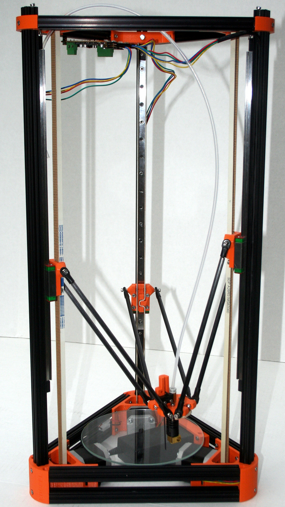
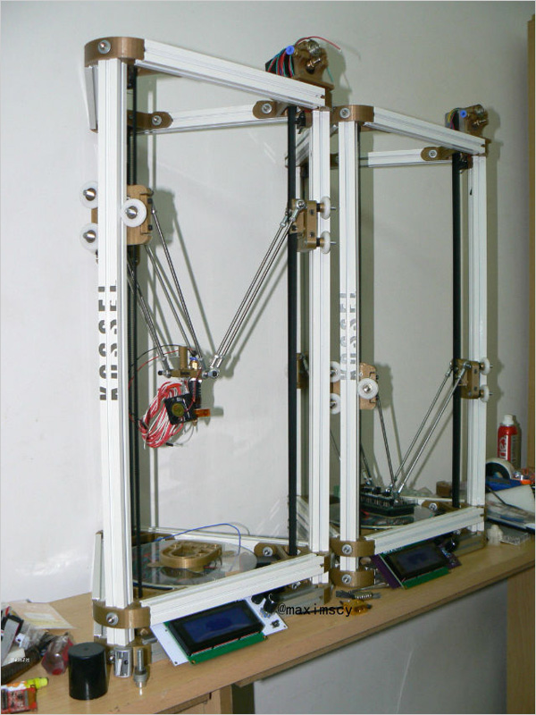
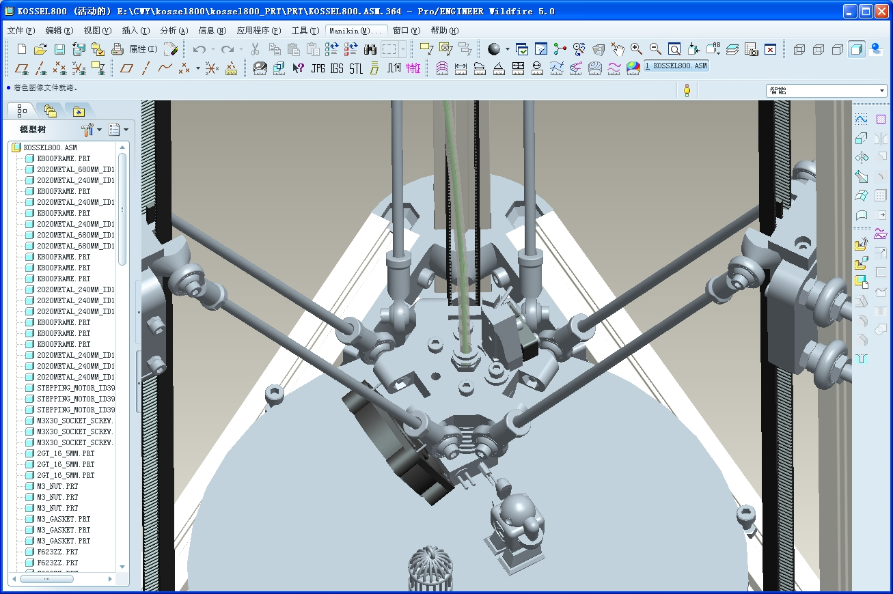
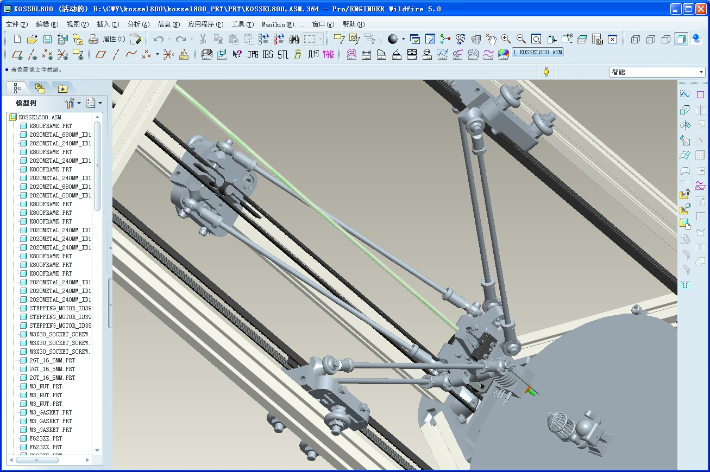
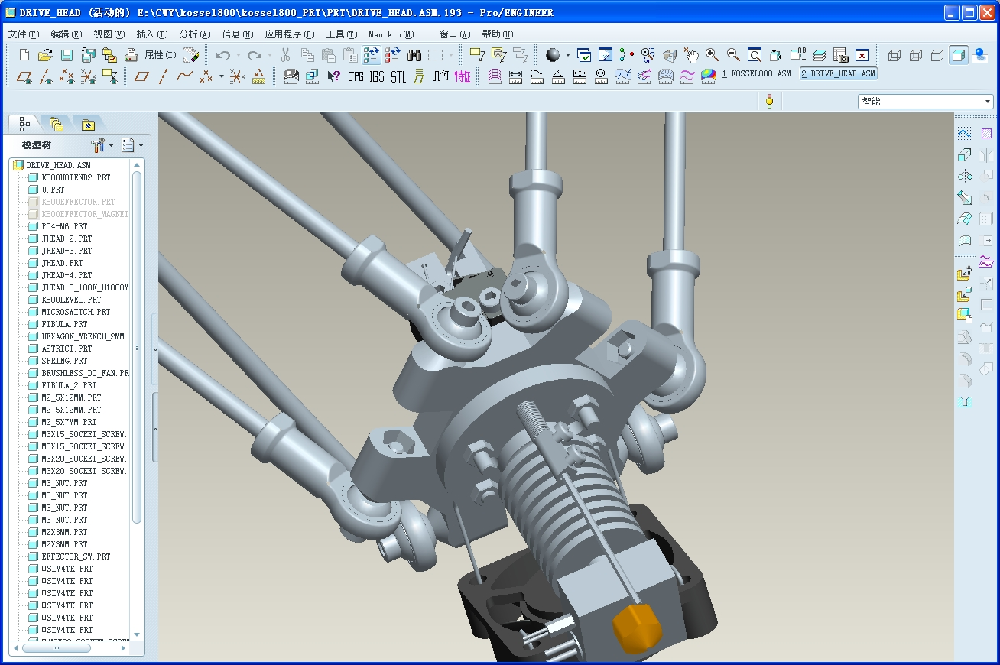

# 3Dprinter

一些三角洲式3D打印机的模型和相关文档，只是对自己大一时的项目记录。
(Some models and documents about 3D printer, just a record.)

# 开源“三角洲”型3D打印机的制作及优化与打印模型器件的改良计划

## 一、想法背景：

2012年年末，国外johann基于罗斯托克的原型进行改造和重新设计，于2013年年中研发出kossel mini，即开源“三角洲”型3D打印机，使得3D打印机行业的机器设计由最初的加热玻璃移动式一改为热挤出头移动式，当时造价约为600美元。

2014年年中，国内maximscy开始尝试用不超过800元人名币的材料，以kossel mini为原型，进行设计简化、改造，使性价比极度提高的方式制作出一台3D打印机，并在网络平台上发表帖子。2015年中，重新设计的机器开始众筹，称为kossel 800（简称k8）并在2015年末获得成功。

 

## 二、初期想法：

在了解kossel mini与kossel 800的大致结构和部件后，结合kossel 800的反馈，我萌生出一个想法：可不可以把二者结合在一起，即一台成本低于kossel mini但性能或稳定性高于kossel 800的开源“三角洲”式3D打印机呢？

我觉得OK。

基于这个想法，我计划对机器进行综合式改造，在整体支架方面运用kossel 800的方案，但是在控制热挤出头移动方面，改为用导轨代替滑轮的方式（虽然后来有人也提出通过改进或者增加模具，增强稳定性，但我觉得还是一劳永逸的好）；在连接中心控制块方面，改kossel 800的强磁并联为kossel mini的鱼眼关节并联臂（为了增加控制块的移动性并且稳定耐用）；在热挤出头方面，运用kossel mini和kossel 800两者结合的方式，以普通42步进电机代替行星步进，通过使用更小比例的挤出轮，避开用行星步进需要硬性改造挤出轮的操作。

我觉得可行。

## 三、优化及升级方案：

* 1.  对机器稳定性、灵活性的优化。按照初期想法，这步便能完成。可加入离机打印的装置，如蓝牙、SD卡、U盘。

* 2.  对机器打印精度、打印质量的优化。这个涉及到建模的技术，建模的精细程度和分块方式很大程度决定了打印的质量；打印进度需要通过改进零件进一步达到。

* 3.  对机器控制程序的优化。首先在能够使机器运行的情况下，充分了解开源代码中的各项参数命令的含义，以求较清楚的知道可能的问题；尝试用python或其他语言编写代码，是否能增加控制性，拥有更多功能。这步其实是难点和优化升级的较关键点。

* 4.  对打印材料的优化。按初步想法制作出的打印机只能打印PLA一种材料，后期通过设备改进，可以达到打印ABS、尼龙等较低熔点但冷却凝固较快的材料。（有个不切实际的想法：打印镓）

* 5.  对打印出的物品优化。如打磨表面、基础上色等。

 

## 四、项目意义：

说实话，这个项目的最大意义还是原理的分析和实践能力的锻炼，理由如下：

* 1.  在初步想法中，很容易提出疑问，为什么打印头移动比加热玻璃移动更具优势？鱼眼关节并联臂的力学结构到底是怎么样的，这种结构在空间上如何应用？等等。

* 2.  在优化升级中，会加深对程序控制、代码编写甚至是数据排列与处理的理解，这个很直接，也是实践的魅力之一。

* 3.  由于经费限制，对于SLA（光固化）以及SLS（选择性激光烧结）、SLM（选择性激光熔化）等材料成型原理的研究受限，我们只能选择最基础但也最成熟的FDM（熔融沉积）进行研究，但我相信这个项目能加深对3D打印的原理，不管是机械原理还是成型原理有更好的理解，对以后的深入学习有必然的帮助。

 

## 一、3D打印机部分：

### 1.   机体部件选择：

#### Ⅰ.电机部分：（注：下列零件打括号的部分是在改进前kossel 800的零件或者规格，改进后不需或者替换使用）

（1）43mm长的42[**步进电机**](http://jump2.bdimg.com/safecheck/index?url=rN3wPs8te/pL4AOY0zAwhz3wi8AXlR5gsMEbyYdIw60LIbkeqzb3nHELIGIiYYBlPOTmzEfauAi3pfKJtUWCTh9ssyDK1SDlnhDg47fRGLxIC1WNLHU2MljwrjhG0RrIDXU2IbH3HytqPm0QcShHsHR+gx0m8lwy+0xqMNX78od49JLSHBbDcRh7U8HwYGGiNyf7AoW6+85T0sjgIIm+zjA8Zu4mdgY0)X4个，42步进负责[**3d****打印机**](http://jump2.bdimg.com/safecheck/index?url=rN3wPs8te/pL4AOY0zAwhz3wi8AXlR5gsMEbyYdIw62D9i3hMu58Ec8lPeh5XYcaN53vq0/MrpUripOOA15C4U+GRIwDgEI46b99l0XyUM/jR49NyMTc/6qmUGNB+hoBDXU2IbH3HytqPm0QcShHsHR+gx0m8lwy+0xqMNX78od49JLSHBbDcRh7U8HwYGGiNyf7AoW6+85T0sjgIIm+zjA8Zu4mdgY0)的“驱动”以及“送丝”工作。

（2）1300（1280）mm长6mm宽2mm齿距GT2传动[**同步带**](http://jump2.bdimg.com/safecheck/index?url=rN3wPs8te/pL4AOY0zAwhz3wi8AXlR5gsMEbyYdIw63KAxApPk/iZvRGO95Q3c2iImOuUl9obIdesUqvhcRz+hXSuwz9b96EragWmZ1jer1XQuxoOXhQsbE/1QTKhsXZB4Yf9I/4itZqXswVV141DFaXuEwQ37OEwpcRnVfrI7q2we3jtEzaBKOonU6ZQ6zJhNvJ9Xyjr7F2Pah4egTNMg==)X3条。“同步带”和“同步轮”负责和“[**步进电机**](http://jump2.bdimg.com/safecheck/index?url=rN3wPs8te/pL4AOY0zAwhz3wi8AXlR5gsMEbyYdIw60LIbkeqzb3nHELIGIiYYBlPOTmzEfauAi3pfKJtUWCTh9ssyDK1SDlnhDg47fRGLxIC1WNLHU2MljwrjhG0RrIDXU2IbH3HytqPm0QcShHsHR+gx0m8lwy+0xqMNX78od49JLSHBbDcRh7U8HwYGGiNyf7AoW6+85T0sjgIIm+zjA8Zu4mdgY0)”协作驱动[**3d****打印机**](http://jump2.bdimg.com/safecheck/index?url=rN3wPs8te/pL4AOY0zAwhz3wi8AXlR5gsMEbyYdIw62D9i3hMu58Ec8lPeh5XYcaN53vq0/MrpUripOOA15C4U+GRIwDgEI46b99l0XyUM/jR49NyMTc/6qmUGNB+hoBDXU2IbH3HytqPm0QcShHsHR+gx0m8lwy+0xqMNX78od49JLSHBbDcRh7U8HwYGGiNyf7AoW6+85T0sjgIIm+zjA8Zu4mdgY0)中的“滑车”和“并联臂”“挤出头底座“部分。

（3）GT2（2GT）同步轮X3个，齿宽7mm，齿距2mm，5mm孔径，齿数16齿。

（4）[**F623zz**](http://jump2.bdimg.com/safecheck/index?url=rN3wPs8te/pL4AOY0zAwhz3wi8AXlR5gsMEbyYdIw623MdagLo7cHbsQuyGWwHBAt6XyibVFgk4fbLMgytUg5Z4Q4OO30Ri8SAtVjSx1NjJY8K44RtEayA11NiGx9x8raj5tEHEoR7B0foMdJvJcMvtMajDV+/KHePSS0hwWw3EYe1PB8GBhojcn+wKFuvvOU9LI4CCJvs4wPGbuJnYGNA==)法兰杯轴承X6个，3X10X4mm，和“电机”“[**同步带**](http://jump2.bdimg.com/safecheck/index?url=rN3wPs8te/pL4AOY0zAwhz3wi8AXlR5gsMEbyYdIw63KAxApPk/iZvRGO95Q3c2iImOuUl9obIdesUqvhcRz+hXSuwz9b96EragWmZ1jer1XQuxoOXhQsbE/1QTKhsXZB4Yf9I/4itZqXswVV141DFaXuEwQ37OEwpcRnVfrI7q2we3jtEzaBKOonU6ZQ6zJhNvJ9Xyjr7F2Pah4egTNMg==)”“同步轮”组成传动部分，驱动“[**滑车**](http://jump2.bdimg.com/safecheck/index?url=rN3wPs8te/pL4AOY0zAwhz3wi8AXlR5gsMEbyYdIw62nXV3+Xxc7+/vujGaniiXQt6XyibVFgk4fbLMgytUg5Z4Q4OO30Ri8SAtVjSx1NjJY8K44RtEayA11NiGx9x8raj5tEHEoR7B0foMdJvJcMvtMajDV+/KHePSS0hwWw3EYe1PB8GBhojcn+wKFuvvOU9LI4CCJvs4wPGbuJnYGNA==)”“并联臂”“挤出头底座”。

（5）625（608 5X16X5mm）轴承X1个，市面上最广泛使用的轴承，和“电机”“咬丝轮”组成送丝机。

（6）孔径5mm，滚花谷底直径6mm，滚花槽深1mm，底座外径12mm，长5mm的咬丝轮，，因为它的小轮径，能使用普通的42步进，而无需高昂的行星步进送丝，配合“[**步进电机**](http://jump2.bdimg.com/safecheck/index?url=rN3wPs8te/pL4AOY0zAwhz3wi8AXlR5gsMEbyYdIw60LIbkeqzb3nHELIGIiYYBlPOTmzEfauAi3pfKJtUWCTh9ssyDK1SDlnhDg47fRGLxIC1WNLHU2MljwrjhG0RrIDXU2IbH3HytqPm0QcShHsHR+gx0m8lwy+0xqMNX78od49JLSHBbDcRh7U8HwYGGiNyf7AoW6+85T0sjgIIm+zjA8Zu4mdgY0)”“625（608）轴承”组成送丝机。

 

#### Ⅱ.控制电路部分：

（1）arduino [**mega2560**](http://jump2.bdimg.com/safecheck/index?url=rN3wPs8te/pL4AOY0zAwhz3wi8AXlR5gsMEbyYdIw602QVD385GIgim8iPfRuY2cZInIi4k8KEu5449mWp1SxBADVCHPuUFSTGH+WZuV+ecUBG6CY6mAz+cOE8LjElMpB4Yf9I/4itZqXswVV141DFaXuEwQ37OEwpcRnVfrI7q2we3jtEzaBKOonU6ZQ6zJhNvJ9Xyjr7F2Pah4egTNMg==)X1块，个别原件或者覆铜用料上有点区别。[**mega2560**](http://jump2.bdimg.com/safecheck/index?url=rN3wPs8te/pL4AOY0zAwhz3wi8AXlR5gsMEbyYdIw602QVD385GIgim8iPfRuY2cZInIi4k8KEu5449mWp1SxBADVCHPuUFSTGH+WZuV+ecUBG6CY6mAz+cOE8LjElMpB4Yf9I/4itZqXswVV141DFaXuEwQ37OEwpcRnVfrI7q2we3jtEzaBKOonU6ZQ6zJhNvJ9Xyjr7F2Pah4egTNMg==)是一块电子diy界烂大街的板子。稳定，方便替换。

（2）[**mega2560**](http://jump2.bdimg.com/safecheck/index?url=rN3wPs8te/pL4AOY0zAwhz3wi8AXlR5gsMEbyYdIw602QVD385GIgim8iPfRuY2cZInIi4k8KEu5449mWp1SxBADVCHPuUFSTGH+WZuV+ecUBG6CY6mAz+cOE8LjElMpB4Yf9I/4itZqXswVV141DFaXuEwQ37OEwpcRnVfrI7q2we3jtEzaBKOonU6ZQ6zJhNvJ9Xyjr7F2Pah4egTNMg==)使用的ramps1.4扩展板X1块，“mega2560”和“ramps1.4”“4988驱动板”共同组成一般开源[**3d****打印机**](http://jump2.bdimg.com/safecheck/index?url=rN3wPs8te/pL4AOY0zAwhz3wi8AXlR5gsMEbyYdIw62D9i3hMu58Ec8lPeh5XYcaN53vq0/MrpUripOOA15C4U+GRIwDgEI46b99l0XyUM/jR49NyMTc/6qmUGNB+hoBDXU2IbH3HytqPm0QcShHsHR+gx0m8lwy+0xqMNX78od49JLSHBbDcRh7U8HwYGGiNyf7AoW6+85T0sjgIIm+zjA8Zu4mdgY0)的控制电路主体。

（3）4988[**步进电机**](http://jump2.bdimg.com/safecheck/index?url=rN3wPs8te/pL4AOY0zAwhz3wi8AXlR5gsMEbyYdIw60LIbkeqzb3nHELIGIiYYBlPOTmzEfauAi3pfKJtUWCTh9ssyDK1SDlnhDg47fRGLxIC1WNLHU2MljwrjhG0RrIDXU2IbH3HytqPm0QcShHsHR+gx0m8lwy+0xqMNX78od49JLSHBbDcRh7U8HwYGGiNyf7AoW6+85T0sjgIIm+zjA8Zu4mdgY0)驱动板X4块，“4988驱动板”和“[**mega2560**](http://jump2.bdimg.com/safecheck/index?url=rN3wPs8te/pL4AOY0zAwhz3wi8AXlR5gsMEbyYdIw602QVD385GIgim8iPfRuY2cZInIi4k8KEu5449mWp1SxBADVCHPuUFSTGH+WZuV+ecUBG6CY6mAz+cOE8LjElMpB4Yf9I/4itZqXswVV141DFaXuEwQ37OEwpcRnVfrI7q2we3jtEzaBKOonU6ZQ6zJhNvJ9Xyjr7F2Pah4egTNMg==)”和“ramps1.4”同组成一般开源[**3d****打印机**](http://jump2.bdimg.com/safecheck/index?url=rN3wPs8te/pL4AOY0zAwhz3wi8AXlR5gsMEbyYdIw62D9i3hMu58Ec8lPeh5XYcaN53vq0/MrpUripOOA15C4U+GRIwDgEI46b99l0XyUM/jR49NyMTc/6qmUGNB+hoBDXU2IbH3HytqPm0QcShHsHR+gx0m8lwy+0xqMNX78od49JLSHBbDcRh7U8HwYGGiNyf7AoW6+85T0sjgIIm+zjA8Zu4mdgY0)的控制电路主体。

 

#### Ⅲ.挤出头零件部分：

（1）马蹄形固定铝片：马蹄形固定铝片的作用是将“打印头”和“打印底座”固定到一起，同时起到了一定的散热作用。

（2）挤出热头（挤出头，打印头，喷头）：挤出热头是[**3d****打印机**](http://jump2.bdimg.com/safecheck/index?url=rN3wPs8te/pL4AOY0zAwhz3wi8AXlR5gsMEbyYdIw62D9i3hMu58Ec8lPeh5XYcaN53vq0/MrpUripOOA15C4U+GRIwDgEI46b99l0XyUM/jR49NyMTc/6qmUGNB+hoBDXU2IbH3HytqPm0QcShHsHR+gx0m8lwy+0xqMNX78od49JLSHBbDcRh7U8HwYGGiNyf7AoW6+85T0sjgIIm+zjA8Zu4mdgY0)的重要部件，出丝是否流畅以及散热能力往往关系到打印机的好坏。现在一般挤出头都采用了特氟龙内壁，所以堵头问题有所改善。一台开源的3d打印机一般由“0.4mm直径挤出头”+“加热铝块”+“加热头”+”100k热敏电阻“+”“铁氟龙喉管”+"铝散热片”+“直插接头”组成。1.75mm丝远程挤出头，基本需要电线长度是50cm（标准）。

（3）散热风扇，12v电压，0.12A电流（电流越大风量越大）的4cm长宽的正方形散热风扇1只。也可以多买一直用于[**3d****打印机**](http://jump2.bdimg.com/safecheck/index?url=rN3wPs8te/pL4AOY0zAwhz3wi8AXlR5gsMEbyYdIw62D9i3hMu58Ec8lPeh5XYcaN53vq0/MrpUripOOA15C4U+GRIwDgEI46b99l0XyUM/jR49NyMTc/6qmUGNB+hoBDXU2IbH3HytqPm0QcShHsHR+gx0m8lwy+0xqMNX78od49JLSHBbDcRh7U8HwYGGiNyf7AoW6+85T0sjgIIm+zjA8Zu4mdgY0)主板的散热。挤出热头的散热关系到打印质量的好坏，所以务必做好散热工作，尤其是夏天务必防止堵头的发生。

（4）四氟管与[**快速接头**](http://jump2.bdimg.com/safecheck/index?url=rN3wPs8te/pL4AOY0zAwhz3wi8AXlR5gsMEbyYdIw63iejwHTNtkrVH+MJSKy5lQmYK/Ssc8usu3pfKJtUWCTh9ssyDK1SDlnhDg47fRGLxIC1WNLHU2MljwrjhG0RrIDXU2IbH3HytqPm0QcShHsHR+gx0m8lwy+0xqMNX78od49JLSHBbDcRh7U8HwYGGiNyf7AoW6+85T0sjgIIm+zjA8Zu4mdgY0)组合：四氟管和快速接头用于远程送丝机型的远程送丝，因为是使用1.75mm直径的塑料丝，所以需要购买内径2mm外径4mm的四氟管，以及插口内径4mm，m5螺纹的快速接头用于组成送丝系统。标高65cm机型需要购买65cm长度的四氟管。

 

#### Ⅳ.[**铝型材**](http://jump2.bdimg.com/safecheck/index?url=rN3wPs8te/pL4AOY0zAwhz3wi8AXlR5gsMEbyYdIw62yCkMCGkgCyhViFUNW2aZ5ImOuUl9obIdesUqvhcRz+hXSuwz9b96EragWmZ1jer1XQuxoOXhQsbE/1QTKhsXZB4Yf9I/4itZqXswVV141DFaXuEwQ37OEwpcRnVfrI7q2we3jtEzaBKOonU6ZQ6zJhNvJ9Xyjr7F2Pah4egTNMg==)与非标件部分：

（1）标准的铝型材使用的是2020欧标（国标 国标铝型材的槽比较窄，所以适合滑轮走动）铝型材，需要的尺寸是24cmX9根；60cmX3根。

（2）非标件。限位开关零件X3，送丝机零件X1，挤出热头底座零件X1，通用框架链接件X9，线轨零件X3（滑车零件X3）。

 

#### Ⅴ.其他零件：

（1）上银导轨X3（19mm直径的浴室用小轮。组装在“滑车”零件上组成滑车零件）

（2）球头拉杆X12，螺杆X12（M4 20mm），碳管X6（内径4mm 180mm）（圆形打孔强磁磁铁，需要的是直径12mm厚4mm M4孔的圆形开孔磁铁。一共需要X12枚磁铁，强磁易损）

（3）[**高硼硅玻璃**](http://jump2.bdimg.com/safecheck/index?url=rN3wPs8te/pL4AOY0zAwhz3wi8AXlR5gsMEbyYdIw61wKKL7J1HyDDNm3n0xppOLAdQhfoPBUdMiY65SX2hsh16xSq+FxHP6FdK7DP1v3oStqBaZnWN6vVdC7Gg5eFCxsT/VBMqGxdkHhh/0j/iK1mpezBVXXjUMVpe4TBDfs4TClxGdV+sjurbB7eO0TNoEo6idTplDrMmE28n1fKOvsXY9qHh6BM0y)：玻璃底盘可以用[**普通玻璃**](http://jump2.bdimg.com/safecheck/index?url=rN3wPs8te/pL4AOY0zAwhz3wi8AXlR5gsMEbyYdIw60LmYBOy96uCRpsL1RrX+yfoFDNlEz2uDq3pfKJtUWCTh9ssyDK1SDlnhDg47fRGLxIC1WNLHU2MljwrjhG0RrIDXU2IbH3HytqPm0QcShHsHR+gx0m8lwy+0xqMNX78od49JLSHBbDcRh7U8HwYGGiNyf7AoW6+85T0sjgIIm+zjA8Zu4mdgY0)或者高硼硅玻璃，高硼硅的话可以以后直接加装热床打印[**abs**](http://jump2.bdimg.com/safecheck/index?url=rN3wPs8te/pL4AOY0zAwhz3wi8AXlR5gsMEbyYdIw61lp1I67AnawiJjrlJfaGyHXrFKr4XEc/oV0rsM/W/ehK2oFpmdY3q9V0LsaDl4ULGxP9UEyobF2QeGH/SP+IrWal7MFVdeNQxWl7hMEN+zhMKXEZ1X6yO6tsHt47RM2gSjqJ1OmUOsyYTbyfV8o6+xdj2oeHoEzTI=)材质的模型，普通玻璃的话无法加热。玻璃尺寸可以购买20cmX3mm厚的或者标准的17cmX3mm厚度的圆形玻璃。

（4）[**限位开关**](http://jump2.bdimg.com/safecheck/index?url=rN3wPs8te/pL4AOY0zAwhz3wi8AXlR5gsMEbyYdIw616wlrziJa+x6AYC6oEA1ccFFsJWbS0QKO3pfKJtUWCTh9ssyDK1SDlnhDg47fRGLxIC1WNLHU2MljwrjhG0RrIDXU2IbH3HytqPm0QcShHsHR+gx0m8lwy+0xqMNX78od49JLSHBbDcRh7U8HwYGGiNyf7AoW6+85T0sjgIIm+zjA8Zu4mdgY0)（[**微动开关**](http://jump2.bdimg.com/safecheck/index?url=rN3wPs8te/pL4AOY0zAwhz3wi8AXlR5gsMEbyYdIw63vsEfg+B3BHXpEZnuM78/4FFsJWbS0QKO3pfKJtUWCTh9ssyDK1SDlnhDg47fRGLxIC1WNLHU2MljwrjhG0RrIDXU2IbH3HytqPm0QcShHsHR+gx0m8lwy+0xqMNX78od49JLSHBbDcRh7U8HwYGGiNyf7AoW6+85T0sjgIIm+zjA8Zu4mdgY0)）：需要3个限位开关，如果需要水平探针调平的话那么需要4个限位开关。限位开关在xyz轴中限定了最大行距，同时限位开关也通过触发功能取得了“玻璃底盘”的是否水平。限位开关需要焊接电线。

（5）电源：使用12V 5A~6A，插头外径5.5mm，孔径2.5mm的笔记本电源。5A~6A的电源功率在70W左右，所以只能加热和打印PLA耗材，如果要使用[**ABS**](http://jump2.bdimg.com/safecheck/index?url=rN3wPs8te/pL4AOY0zAwhz3wi8AXlR5gsMEbyYdIw60D+GVLfnxwRiJjrlJfaGyHXrFKr4XEc/oV0rsM/W/ehK2oFpmdY3q9V0LsaDl4ULGxP9UEyobF2QeGH/SP+IrWal7MFVdeNQxWl7hMEN+zhMKXEZ1X6yO6tsHt47RM2gSjqJ1OmUOsyYTbyfV8o6+xdj2oeHoEzTI=)打印需要加装150W以上的电源。

（6）水平调平部分五金件：水平调平部分使用到了许多五金件：圆柱笔弹簧X1个，接线端子铜件X1,1.5mm加长内六角扳手X1个。加长型1.5mm内六角扳手（12cm长左右）需要根据不同种类的喷头长度设计。不可使用不加长的内六角扳手，否则无法调平。

 

#### Ⅵ.杂件：

（1）绕线管：用于将电线收到一起。

（2）螺丝 螺母 垫片

（3）[**游标卡尺**](http://jump2.bdimg.com/safecheck/index?url=rN3wPs8te/pL4AOY0zAwhz3wi8AXlR5gsMEbyYdIw63bhoOmA9k04nHX6Q3YxG5vAMaA+wRot+y3pfKJtUWCTh9ssyDK1SDlnhDg47fRGLxIC1WNLHU2MljwrjhG0RrIDXU2IbH3HytqPm0QcShHsHR+gx0m8lwy+0xqMNX78od49JLSHBbDcRh7U8HwYGGiNyf7AoW6+85T0sjgIIm+zjA8Zu4mdgY0)：用于各种测量核对误差。精度0.1即可，0.02精度为佳。六角[**扳手**](http://jump2.bdimg.com/safecheck/index?url=rN3wPs8te/pL4AOY0zAwhz3wi8AXlR5gsMEbyYdIw60A8adDvQmh4NfgMhGUQzBst6XyibVFgk4fbLMgytUg5Z4Q4OO30Ri8SAtVjSx1NjJY8K44RtEayA11NiGx9x8raj5tEHEoR7B0foMdJvJcMvtMajDV+/KHePSS0hwWw3EYe1PB8GBhojcn+wKFuvvOU9LI4CCJvs4wPGbuJnYGNA==)：m1.5，m2，m2.5，m3，m4，m5各一。美工刀。（[**AB****胶**](http://jump2.bdimg.com/safecheck/index?url=rN3wPs8te/pL4AOY0zAwhz3wi8AXlR5gsMEbyYdIw61GBDvcEokxXNlZs2EYum7QK4qTjgNeQuFPhkSMA4BCOOm/fZdF8lDP40ePTcjE3P+qplBjQfoaAQ11NiGx9x8raj5tEHEoR7B0foMdJvJcMvtMajDV+/KHePSS0hwWw3EYe1PB8GBhojcn+wKFuvvOU9LI4CCJvs4wPGbuJnYGNA==)：用于粘住开孔圆形磁铁等工作，最普通的即可）

 

#### Ⅶ.优化部件：

（1）Reprap2004智能[**lcd****模块**](http://jump2.bdimg.com/safecheck/index?url=rN3wPs8te/pL4AOY0zAwhz3wi8AXlR5gsMEbyYdIw62Z2X+QX938zvvs9kjJPcbZImOuUl9obIdesUqvhcRz+hXSuwz9b96EragWmZ1jer1XQuxoOXhQsbE/1QTKhsXZB4Yf9I/4itZqXswVV141DFaXuEwQ37OEwpcRnVfrI7q2we3jtEzaBKOonU6ZQ6zJhNvJ9Xyjr7F2Pah4egTNMg==)X1块，这个lcd液晶和sd卡结合的操控模块，如果使用的话打印机可以脱离电脑，配合sd卡存储的数据实现脱机打印。

（2）HC-06[**蓝牙**](http://jump2.bdimg.com/safecheck/index?url=rN3wPs8te/pL4AOY0zAwhz3wi8AXlR5gsMEbyYdIw60xL60xQx7UUCldnjr24d5qt6XyibVFgk4fbLMgytUg5Z4Q4OO30Ri8SAtVjSx1NjJY8K44RtEayA11NiGx9x8raj5tEHEoR7B0foMdJvJcMvtMajDV+/KHePSS0hwWw3EYe1PB8GBhojcn+wKFuvvOU9LI4CCJvs4wPGbuJnYGNA==)模块X1块，reprap开源打印机可以使用JY-MCU；HC-06等从机[**蓝牙模块**](http://jump2.bdimg.com/safecheck/index?url=rN3wPs8te/pL4AOY0zAwhz3wi8AXlR5gsMEbyYdIw60xL60xQx7UUFpU0ILOA9FGml9O85zEcMi3pfKJtUWCTh9ssyDK1SDlnhDg47fRGLxIC1WNLHU2MljwrjhG0RrIDXU2IbH3HytqPm0QcShHsHR+gx0m8lwy+0xqMNX78od49JLSHBbDcRh7U8HwYGGiNyf7AoW6+85T0sjgIIm+zjA8Zu4mdgY0)，配合笔记本电脑的蓝牙，或者电脑安装[**蓝牙usb**](http://jump2.bdimg.com/safecheck/index?url=rN3wPs8te/pL4AOY0zAwhz3wi8AXlR5gsMEbyYdIw60xL60xQx7UUOcBGpE0YAsgImOuUl9obIdesUqvhcRz+hXSuwz9b96EragWmZ1jer1XQuxoOXhQsbE/1QTKhsXZB4Yf9I/4itZqXswVV141DFaXuEwQ37OEwpcRnVfrI7q2we3jtEzaBKOonU6ZQ6zJhNvJ9Xyjr7F2Pah4egTNMg==)，就可以直接无线打印。安装到arduino mega2560上的时候需要并联和串联两个电阻降压使用。

 

### 2. 控制与驱动型软件：

Ⅰ.Cura、Slic3r、Kisslicer、Simplify 3D等相关的切片软件，对建模后形成的STL文件进行Gcode的转换。

Ⅱ.Pritrun、Repetier Host、MatterControl等控制软件，用于对挤出机xyz轴的三轴移动的控制以及对打印机的调零。

 

## 二、建模相关软件部分：

### 建模软件：

Ⅰ.机械建模：UG、Proe、Catia、SolidWorks

Ⅱ.动画建模：Zbursh、Maya

Ⅲ.家具建模：3ds MAX

Ⅳ.3D逆向建模软件（需要3D扫描仪，应该不会使用）：Geomagic Studio、imagerware

 

### 辅助软件：

Ⅰ.修复软件：netfabb、magics（用于修复stl或obj格式文件转换后文件可能产生的漏洞、坏线、断面）

Ⅱ.支撑软件：meshmixer（3D较复杂的建模后必然有悬空的部分，这些部分在堆积过程中需要先打印些柔软的支撑）

 

## 三、原理简述：

* 1.  安装原理：我并未找到kossel mini的图纸，但是还好kossel 800的3D图纸以及分散零件图比较容易获得，虽然改造后，不论是对kossel mini的部分结构还原，还是对kossel 800的结构继承，还是新加入结构的结合都有难度，但是，抽象出来也就是个拼图游戏，不是吗？

* 2.  控制原理：运用arduino平台，先载入Marlin固件，刷固件（有点类似电脑主板刷BIOS驱动程序），再运行控制类软件，在刷固件和软件控制中可运用C++语言控制初始参数，之后也可调整。

* 3.  建模原理：这部分……建模后进行文件格式转换，倒入修复软件，添加支撑之类的，在再转换为Gcode，使得arduino能够识别并开始运作。

* 4.  打印原理：热挤出头受控后，在电源的供电下，加热到可以熔化材料丝的温度，使得材料丝熔化，打印端依照Gcode指令移动，使液状的材料堆积成型。

* 5.  总理：安装机器→固件驱动载入→控制程序载入→调零调平→传入转换打印文件→开始打印→打印件处理

